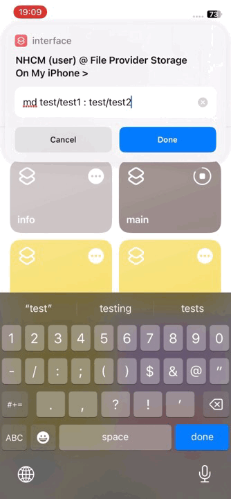

# SDOS
  
Shortcuts Disk Operating System  

A DOS base on iOS/iPadOS with shortcuts app and Files app  
# Preview
* The "md" command  
  
> Two directories were successfully created
* The "edit" command  

> A text file was successfully created
* The "ren" command  

> Succesfully renamed two directories to name "new"
* The "dir" command  

> Listed directory successfully
* The "type" command  

> Typed the content of helloworld.txt successfully
# Required
* iOS/iPadOS 16.7.2 or higher
* Installed "Shortcuts" and "Files" app
# Install
* Download X.X.X\_full.zip from release.
* Extract.
* Click every file that you get in Files app to import them to Shortcuts app.
* Once you done, run shortcut “main"
